# Testing
## Table of Contents
 
## Manual Testing
Throughout this section, tests have been divided into sections based on each stage of the game sequence, and marked as a certain category. The expected and actual results are given, along with a pass/fail indicator. Each test has a unique reference number and, where applicable, these numbers are matched to screenshots of the test results below each table.
 
### Game Setup
 
| Test | Category         | Expected Result                     | Actual Result                                              | Pass/Fail |
|------|------------------|-------------------------------------|------------------------------------------------------------|-----------|
|1.1   |Loading Information | Home screen with title and welcome message appears upon pressing run program button | Full screen loads as expected |Pass|
|1.2   |Loading Information| Pressing Enter loads Instructions, with a further prompt to press enter to set up game at bottom of screen | Instructions loads as expected, prompt message appears after instructions |Pass|
|1.3   |Loading Information| Pressing Enter after instructions are given results in number of players selection stage | Upon pressing enter a message stating asking user to select number of players appears as expected  |Pass|
|1.4   |Input Validation| Entering a non numerical symbol at number of players selection stage results in warning message and user is asked to retry| 'd' is inputted and a message stating input must be either 1 or 2 appears, user is promted to reselct number of players |Pass|
|1.5   |Input Validation| Entering a number other than 1 or 2 at number of players selection stage results in warning message and user is asked to retry| '3' is inputted and a message stating input must be either 1 or 2 appears, user is promted to reselct number of players |Pass|
|1.6   |Input Validation| Entering 1 results in a message to allow the user to choose username | '1' is inputted and a username input message appears as expected |Pass|
|1.7   |Input Validation| User is able to enter username consisting of any symbol | Username consisting of letters, numbers and special characters is entered and input is accepted |Pass|
|1.8   |Loading Information| Entering username results in prompt message asking user to select their color, with username appearing at start of message  | Prompt message appears with username and color selection as expected |Pass|
|1.9   |Input Validation| Entering anything other than 'red' or 'yellow' results in message asking user to select from available colors  |'blue' is entered, feedback appears as expected and user is asked to reselect colors |Pass|
|1.10   |Input Validation| Entering 'red' takes the user to the game play screen |'red' is entered and game screen loads as expected  |Pass|
|1.11   |Input Validation| Entering 'yellow' takes the user to the game play screen |'yellow' is entered and game screen loads as expected  |Pass|
|1.12   |Loading Information| Entering 'red' at color selection results in red counter appearing during gameplay prompts|'red' is entered gameplay input message appears with red counter  |Pass|
|1.13   |Loading Information| Entering 'yellow' at color selection results in red counter appearing during gameplay prompts|'red' is entered and gameplay input message appears with red counter  |Pass|

### Screenshots where applicable for Game Setup

  1.1                        | 1.2
:-------------------------:|:-------------------------:
 | 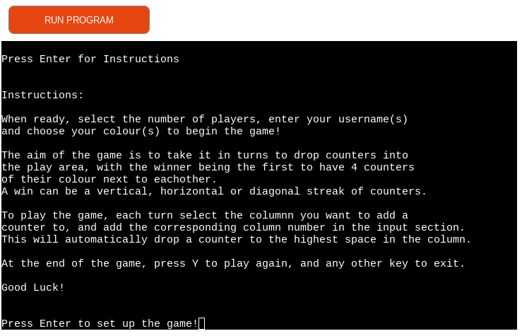
 
 1.3                     | 1.4
:-------------------------:|:-------------------------:
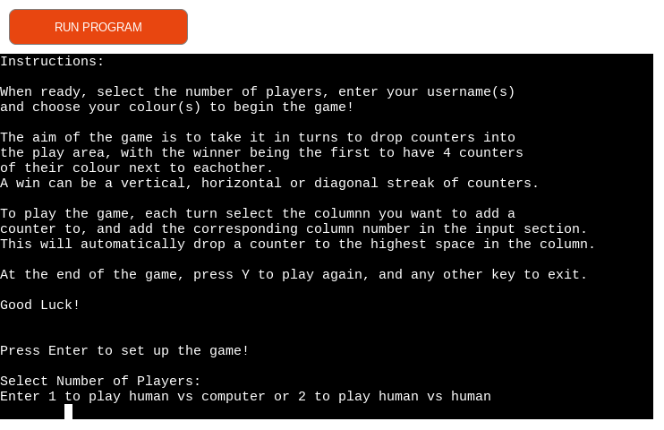 | 

1.5                     | 1.6
:-------------------------:|:-------------------------:
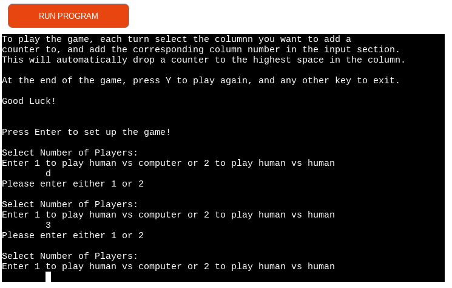 | 

1.7, 1.8                     | 1.9
:-------------------------:|:-------------------------:
 | 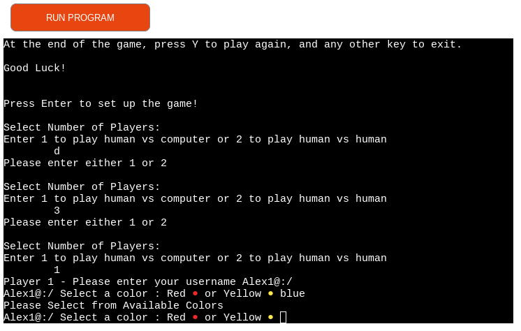

1.12                       | 1.13
:-------------------------:|:-------------------------:
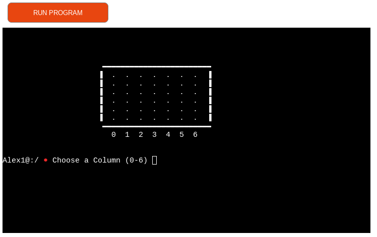 | 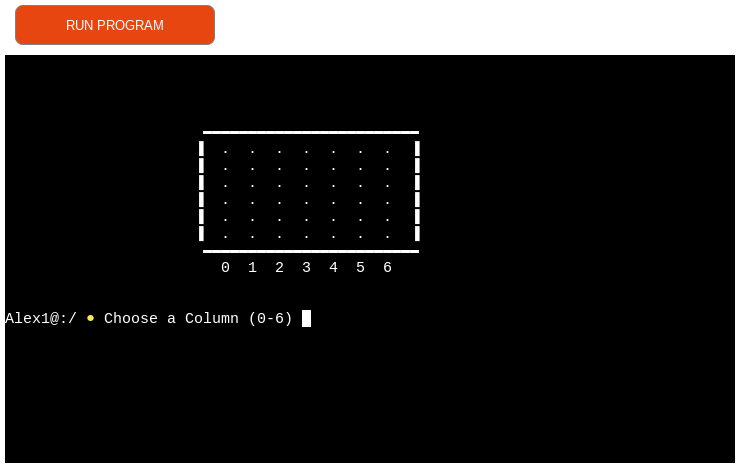

### Game Play

| Test | Category         | Expected Result                     | Actual Result                                              | Pass/Fail |
|------|------------------|-------------------------------------|------------------------------------------------------------|-----------|
|2.1   |Input Validation  | When column selection prompt appears, letters cannot be inputted | 'd' is entered and feedback is given to user to choose a whole number between 0 and 6 |Pass|
|2.2   |Input Validation  | Numbers outwith 0 - 6 cannot be entered to column selection| '7' is entered and feedback is given to user to choose a whole number between 0 and 6 |Pass|
|2.3   |Input Validation  | Non integers cannot be entered to column selection| '1.5' is entered and feedback is given to user to choose a whole number between 0 and 6 |Pass|
|2.4   |Loading Information  | When a whole number between 0 and 6 is entered, the current users counter is added to the corresponding column | '6' is entered and a counter appears in column 6 |Pass|
|2.5   |Logic | In human vs computer mode, a computer is thinking message appears once user enters column selection | Users counter is added and message appears as expected |Pass|

2.1                        | 2.2
:-------------------------:|:-------------------------:
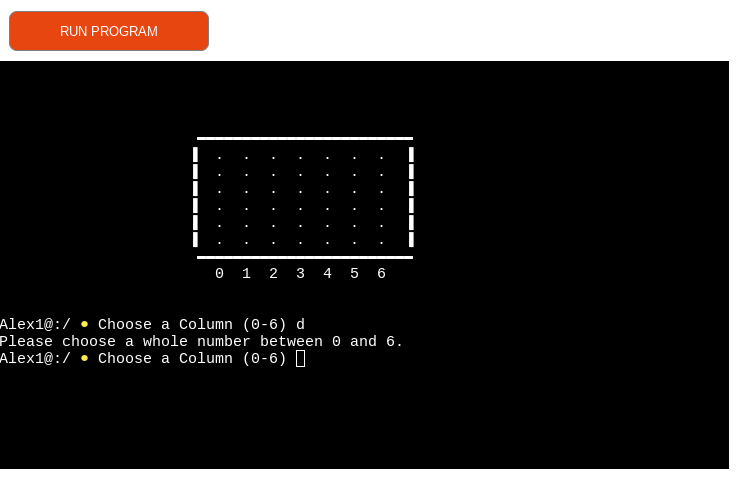 | 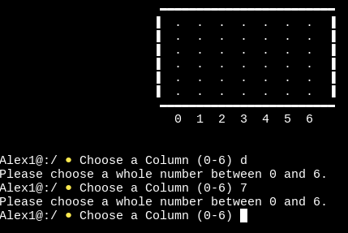

2.3                        | 2.4
:-------------------------:|:-------------------------:
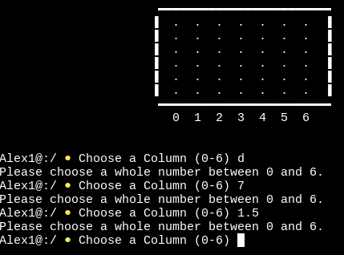 | 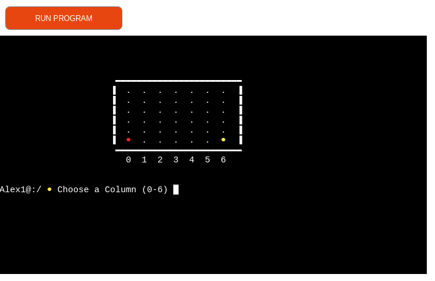

2.5                        | 2.4
:-------------------------:|:-------------------------:
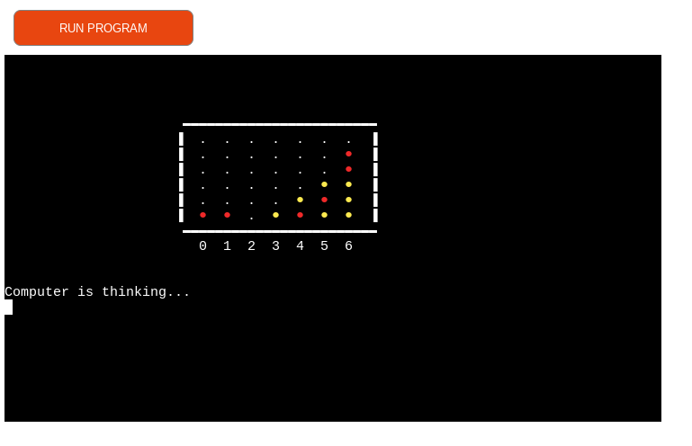 | 

### Issues Found
 
 
## User Stories Testing

 
## Validation Testing
 
