# Testing
Back to [README.MD](https://github.com/AlexSmall96/Connect-Four/blob/main/README.md).
## Table of Contents
  * [Table of Contents](#table-of-contents)
  * [Manual Testing](#manual-testing)
    + [Game Setup](#game-setup)
    + [Screenshots where applicable for Game Setup](#screenshots-where-applicable-for-game-setup)
    + [Game Play - Single Player Mode](#game-play---single-player-mode)
    + [Screenshots where applicable for Game Play - Single Player Mode](#screenshots-where-applicable-for-game-play---single-player-mode)
    + [Game Play - Two Player Mode](#game-play---two-player-mode)
    + [Screenshots where applicable for Game Play - Two Player Mode](#screenshots-where-applicable-for-game-play---two-player-mode)
    + [Win Detection](#win-detection)
    + [Screenshots where applicable for Win Detection](#screenshots-where-applicable-for-win-detection)
    + [Replay and Exiting Game](#replay-and-exiting-game)
    + [Screenshots where applicable for Replay and Exiting Game](#screenshots-where-applicable-for-replay-and-exiting-game)
    * [Issues Found](#isses-found)
  * [User Stories Testing](#user-stories-testing)
  * [Validation Testing](#validation-testing)
## Manual Testing
Throughout this section, tests have been divided into sections based on each stage of the game sequence and marked as a certain category. The expected and actual results are given, along with a pass/fail indicator. Each test has a unique reference number and, where applicable, these numbers are matched to screenshots of the test results below each table.
 
### Game Setup
 
| Test | Category         | Expected Result                     | Actual Result                                              | Pass/Fail |
|------|------------------|-------------------------------------|------------------------------------------------------------|-----------|
|1.1   |Loading Information | Home screen with title and welcome message appears upon pressing run program button | Full screen loads as expected |Pass|
|1.2   |Loading Information| Pressing Enter loads Instructions, with a further prompt to press enter to set up game at bottom of screen | Instructions load as expected, prompt message appears after instructions |Pass|
|1.3   |Loading Information| Pressing Enter after instructions are given results in number of players selection stage | Upon pressing enter a message asking user to select number of players appears as expected  |Pass|
|1.4   |Input Validation| Entering a non numerical symbol at number of players selection stage results in warning message and user is asked to retry| 'd' is inputted and a message stating input must be either 1 or 2 appears, user is prompted to reselect number of players |Pass|
|1.5   |Input Validation| Entering a number other than 1 or 2 at number of players selection stage results in warning message and user is asked to retry| '3' is inputted and a message stating input must be either 1 or 2 appears, user is prompted to reselect number of players |Pass|
|1.6   |Input Validation| Entering 1 results in a message to allow the user to choose username | '1' is inputted and a username input message appears as expected |Pass|
|1.7   |Input Validation| User is able to enter username consisting of any symbol | Username consisting of letters, numbers, and special characters is entered and input is accepted |Pass|
|1.8   |Loading Information| Entering username results in prompt message asking user to select their color, with username appearing at start of message  | Prompt message appears with username and color selection as expected |Pass|
|1.9   |Input Validation| Entering anything other than 'red' or 'yellow' results in message asking user to select from available colors  |'blue' is entered, feedback appears as expected and user is asked to reselect colors |Pass|
|1.10   |Input Validation| Entering 'red' takes the user to the gameplay screen |'red' is entered and game screen loads as expected  |Pass|
|1.11   |Input Validation| Entering 'yellow' takes the user to the gameplay screen |'yellow' is entered and game screen loads as expected  |Pass|
|1.12   |Loading Information| Entering 'red' at color selection results in red counter appearing during gameplay prompts|'red' is entered gameplay input message appears with red counter  |Pass|
|1.13   |Loading Information| Entering 'yellow' at color selection results in yellow counter appearing during gameplay prompts|'red' is entered and gameplay input message appears with red counter  |Pass|
|1.14   |Loading Information| Entering 2 at select number of players stage results in a prompt for payer 1 to enter username, followed by a prompt for player 2 to enter username once player 1 has completed input |2 is entered and prompt 1 appears, followed by prompt 2 upon completing prompt 1 input |Pass|
|1.15   |Input Validation| If usernames are the same, a message stating usernames must be different appears, and both users are asked to reselect usernames  |Username is entered for both players and feedback appears as expected|Pass|
|1.16   |Loading Information| Once both usernames are selected, player 1 is prompted to select their color |Both usernames are entered, and player 1 username appears asking them to select a color|Pass|
|1.17   |Logic| Player 2's color is automatically assigned to the color that player 1 didn't select |Player 1 selects red and player 2 is assigned yellow |Pass|

### Screenshots where applicable for Game Setup

  1.1                        | 1.2
:-------------------------:|:-------------------------:
 | 
 
 1.3                     | 1.4
:-------------------------:|:-------------------------:
 | 

1.5                     | 1.6
:-------------------------:|:-------------------------:
 | 

1.7, 1.8                     | 1.9
:-------------------------:|:-------------------------:
 | 

1.12                       | 1.13
:-------------------------:|:-------------------------:
 | 

1.14                       | 1.15
:-------------------------:|:-------------------------:
 | 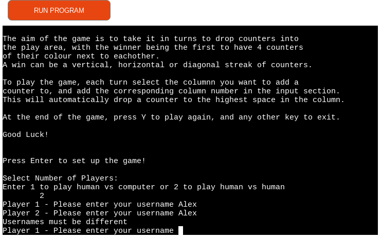

1.16                       |1.17
:-------------------------:|:-------------------------:
|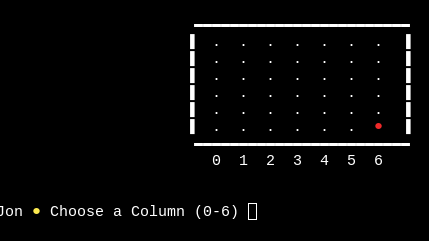

### Game Play - Single Player Mode

| Test | Category         | Expected Result                     | Actual Result                                              | Pass/Fail |
|------|------------------|-------------------------------------|------------------------------------------------------------|-----------|
|2.1   |Input Validation  | When column selection prompt appears, letters cannot be inputted | 'd' is entered and feedback is given to user to choose a whole number between 0 and 6 |Pass|
|2.2   |Input Validation  | Numbers outwith 0 - 6 cannot be entered into column selection| '7' is entered and feedback is given to user to choose a whole number between 0 and 6 |Pass|
|2.3   |Input Validation  | Non-integers cannot be entered into column selection| '1.5' is entered and feedback is given to user to choose a whole number between 0 and 6 |Pass|
|2.4   |Loading Information  | When a whole number between 0 and 6 is entered, the current users counter is added to the corresponding column | '6' is entered and a counter appears in column 6 |Pass|
|2.5   |Logic | When user selects a column with counter already on it, the counter is added to the next row up | User selects column and counter appears above highest counter in column as expected |Pass|
|2.6   |Logic | Computer is thinking message appears once user enters column selection | Users counter is added and message appears as expected |Pass|
|2.7   |Logic | Once computer is thinking message disappears, computers counter appears in a random column (computer column choice is non-random in certain cases - see [Win Detection](#win-detection)) | Computer message disappears and the corresponding counter color is added to the game area |Pass|
|2.8   |Logic | If computer chooses a column that already has a counter in it, the computers counter is added to the next row up | Computer chooses a column with counter on bottom row and counter is added to row directly above as expected |Pass|
|2.9   |Logic | If user chooses a full column, a message stating column is full appears and user is prompted to reselect a column| Full column is chosen and feedback is given to user as expected |Pass|
|2.10   |Logic | Computer never chooses full column| Computer's choice is always a column with an available space as expected |Pass|

### Screenshots where applicable for Game Play - Single Player Mode

2.1                        | 2.2                      |2.3
:-------------------------:|:-------------------------:|:-------------------------:
 | |

2.4                        | 2.5         
:-------------------------:|:-------------------------: 
  |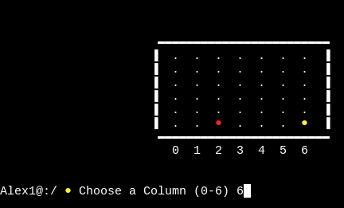 

2.6                        | 2.7
:-------------------------:|:-------------------------:
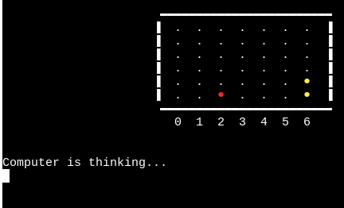 | 

 2.8                        | 2.9         
:-------------------------:|:-------------------------: 
 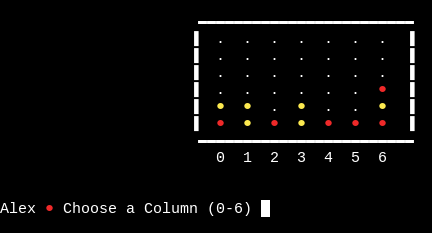 | 

### Game Play - Two-Player Mode

| Test | Category         | Expected Result                     | Actual Result                                              | Pass/Fail |
|------|------------------|-------------------------------------|------------------------------------------------------------|-----------|
|3.1   |Logic | Once one player has selected a column, the other player is prompted with username appearing before message| Prompt message alternates between usernames and counter colors as expected|Pass|
|3.2   |Logic | When either player selects a column with a counter already on it, the counter is added to the next row up| Counter is added 1 row above for either player as expected|Pass|
|3.3   |Logic | When either player selects a full column, a message stating column is full appears and user is prompted to reselect a column| Feedback appears as expected when either player selects a full column|Pass|

### Screenshots where applicable for Game Play - Two Player Mode

 3.1                        | 3.2    
:-------------------------:|:-------------------------: 
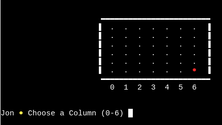 |   

 3.3                        |
:-------------------------:|
  |

### Win Detection

| Test | Category         | Expected Result                     | Actual Result                                              | Pass/Fail |
|------|------------------|-------------------------------------|------------------------------------------------------------|-----------|
|4.1   |Logic | When a player or computer has a vertical streak of 4 of their counters in any column, the game is ended| Vertical streak is reached in any column, and game ends. A sample of columns is given as screenshots |Pass|
|4.2  |Logic | When a player or computer has a horizontal streak of 4 of their counters in any row, the game is ended| Horizontal streak is reached in any row, and game ends. A sample of rows is given as screenshots |Pass|
|4.3  |Logic | When a player or computer has a diagonal streak of 4 of their counters the game is ended| Diagonal streak is reached and game ends. A sample of scenarios is given as screenshots |Pass|
|4.4   |Logic | When a player wins the game, a well done message appears containing their username | User wins and message appears as expected (See 4.1 - 4.3 screenshots) |Pass|
|4.5  |Logic | When the computer wins, a message containing the player's username appears stating computer has won| Computer wins and message appears as expected|Pass|
|4.6  |Logic | In single-player mode, computer detects when player is about to win and if possible, blocks their streak with a counter| Player has a streak of 3, and computer blocks as expected|Pass|
|4.7  |Logic | In single-player mode, computer detects when itself is about to win and if possible, adds a counter to its own streak| Computer has a streak of 3 and next move from computer is winning move as expected|Pass|

### Screenshots where applicable for Win Detection

- For tests 4.1, 4.2, and 4.3, a sample of scenarios has been given as screenshots. Examining the logic in board.check_winner function shows that the below screenshots can be extrapolated as evidence of all scenarios passing the test. The Function is also independent of whether computer or human played the streak, therefore the given screenshots also apply to single-player mode.

- 4.1: Below is a sample of scenarios where a vertical win has been detected. 

6th column red win                      | 3rd column yellow win | 
:-------------------------:|:-------------------------: 
|   

- 4.2: Below is a sample of scenarios where a horizontal win has been detected. Above each image, the column range over which the streak is achieved is given.

0 - 3 yellow win    | 1 - 4 yellow win        | 2 - 5 red win | 3 - 6 red win
:-------------------------:|:-------------------------:|:-------------------------:|:-------------------------: 
| |  |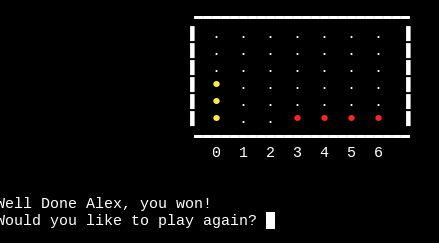 

- 4.3 Below is a sample of scenarios where a diagonal win has been detected. Above each image, the column range over which the streak is achieved is given, along with the slope direction.

0 - 3 upwards red win  | 1 - 4 upwards red win      |  2 - 5 upwards red win |  3 - 6 upwards red win
:-------------------------:|:-------------------------:|:-------------------------:|:-------------------------: 
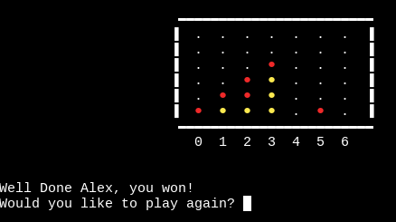| 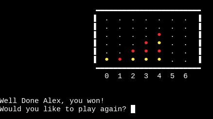|  |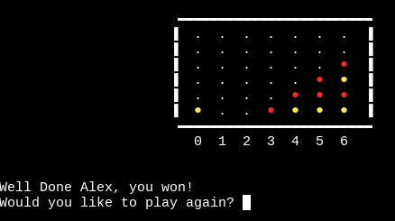 

0 - 3 downwards yellow win  | 1 - 4 downwards yellow win      |  2 - 5 downwards yellow win |  3 - 6 downwards yellow win
:-------------------------:|:-------------------------:|:-------------------------:|:-------------------------: 
| 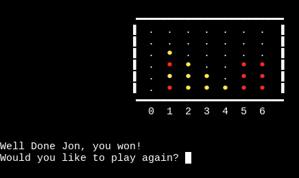| 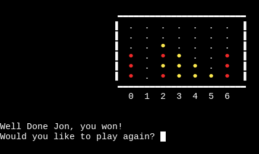 |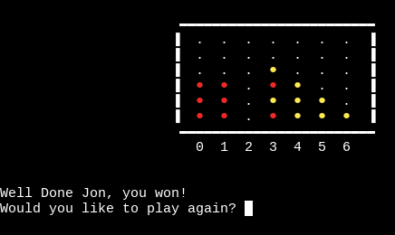 

4.5, 4.6, 4.7 | 
:-------------------------:|
|  

### Replay and Exiting Game

| Test | Category         | Expected Result                     | Actual Result                                              | Pass/Fail |
|------|------------------|-------------------------------------|------------------------------------------------------------|-----------|
|5.1   |Loading Information | When a game is ended, entering 'y' takes the user back to the instructions | 'y' is entered and instructions screen appears as expected|Pass|
|5.2   |Loading Information | Usernames and colors are reselected when game is replayed| Pressing enter on second instructions screen loading prompts username and color selection as expected|Pass|
|5.3   |Loading Information | Game screen loads as normal when game is replayed| Game screen loads as expected|Pass|
|5.4   |Loading Information | Pressing enter without inputting 'y' at end of game exits game and goodbye message appears| Enter is pressed at end of game and message appears as expected|Pass|

### Screenshots where applicable for Replay and Exiting Game
5.1                     | 5.4                         | 
:-------------------------:|:-------------------------: 
| 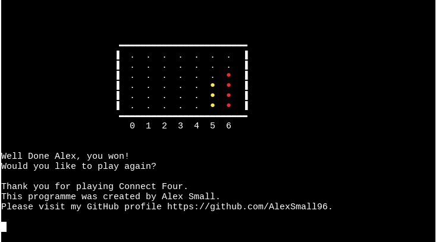  

## Issues Found
In single-player mode, when the 'Computer is thinking message...' is displayed, the user can still input their column choice. This input is then accepted as their choice for their next turn, as a result, multiple counters can appear on the screen at once. A potential solution to this may be to flush the input stream while the message is displayed, forcing the computer to ignore any inputs from the user until it is their turn. I chose not to implement this feature as it was beyond the scope of this project. Further research also showed that it may not be compatible with all systems (eg. windows). The following  [Stack Overflow](https://stackoverflow.com/questions/2520893/how-to-flush-the-input-stream) post details the issues and potential solutions.

## User Stories Testing
The site has been tested according to the user stories and fulfills all the needs given:
As a site user, I want to:

- See a visually appealing title that fits the theme of the game
  - The site loads the title immediately, displaying the words 'Connect Four' in an arcade-style text. The text is large and bold, with the letter 'o's colored with the game counter colors. The pixelated text fits well with the classic arcade style of a python terminal game.
- Receive clear instructions on how to set up and play the game
  - The user is immediately taken to the instructions screen after the title, the rules of the game itself are explained clearly as well as how to input information. The user has clear instructions as to how to set their username(s) and number of players.
- Customise elements of the game such as username
  - The user has choice regarding their username, counter color, and whether they play against the computer or another user on the same device.
- Receive clear feedback on the outcome of the game
  - Throughout the game, the counters are bright and easy to see, the game board is well structured making it easy to keep track of progress in the game. In two-player mode, the winner is stated with a well done message containing their username and counter color. In single-player mode, if the user loses, a commiserations message appears stating that the computer one, which also contains the player's username.
- Have the ability to replay the game
  - Once the game has ended, the user can choose to replay the game, with the instructions, username selection, no of players selection, and counter color selection all reappearing, before the game screen reloads.
 
## Validation Testing
### Python Validator
 All three .py files have been validated through the [Code Institute Python Validator](https://pep8ci.herokuapp.com/) and returned clear with no errors found.

 - run.py
 
  

  - setup.py

 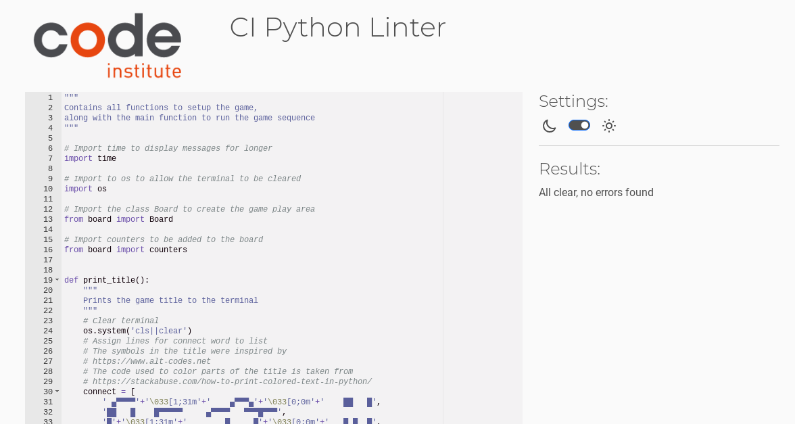

- board.py

 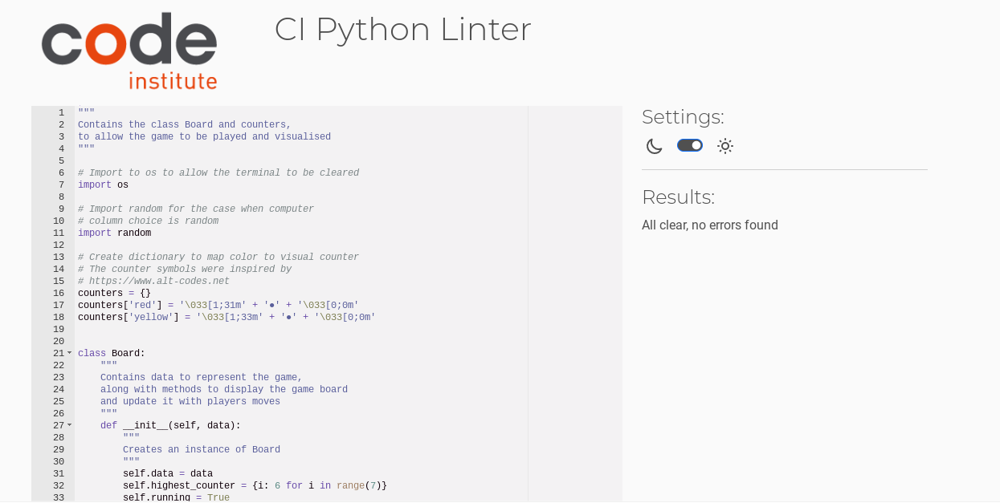

